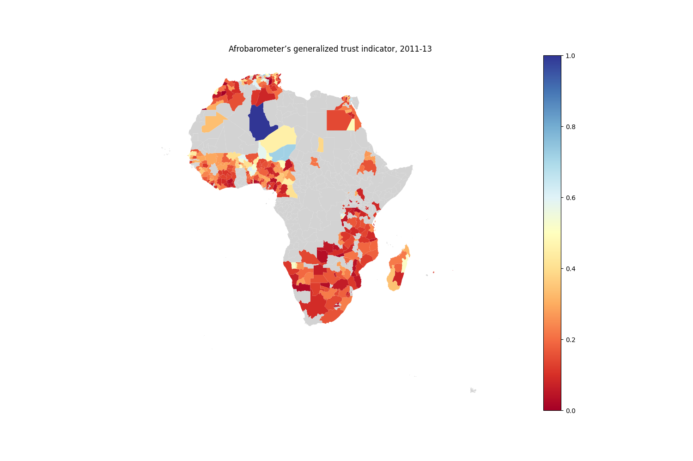
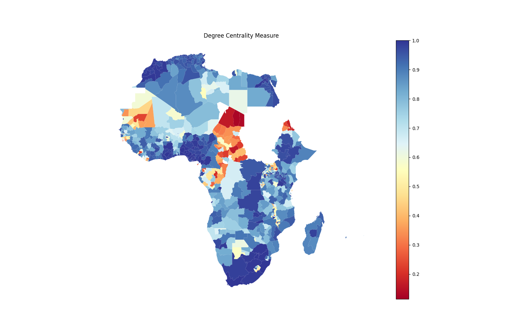
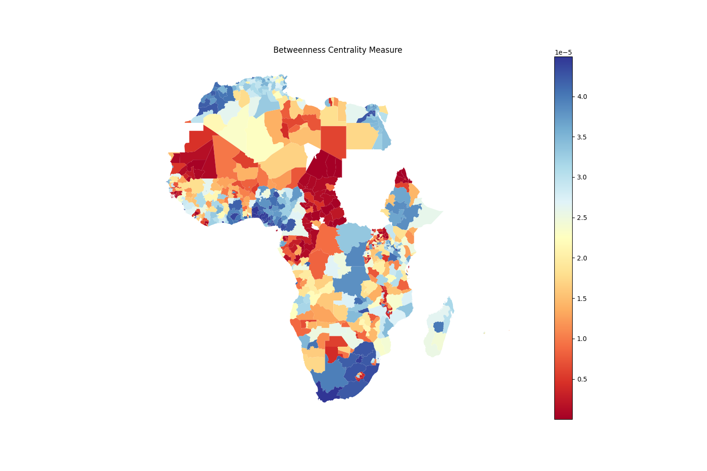
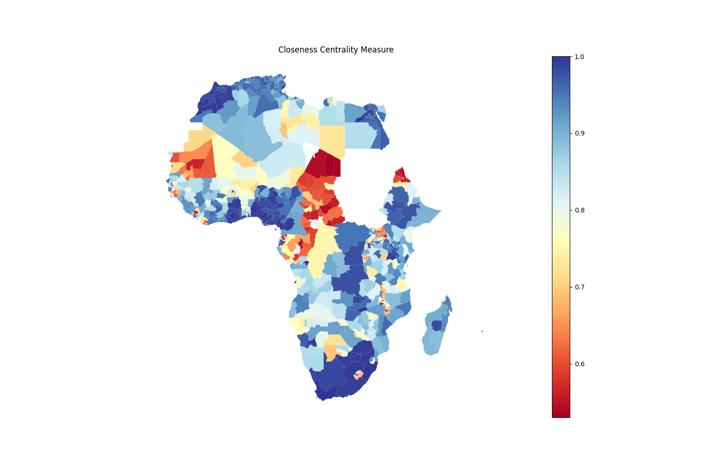

# Social connectedness and health inequalities

Git repository for the corresponding paper with the working title 'Social connectedness and health inequalities'

<div class="row">
  <div class="column" style="float: left; width: 50%">
    
  </div>
  <div class="column" style="float: right; width: 50%">
    
  </div>
</div>

<div class="row">
  <div class="column" style="float: left; width: 33.33%">
    
  </div>
  <div class="column" style="float: right; width: 33.33%">
    
  </div>
<div class="column" style="float: right; width: 33.33%">
    
  </div>
</div>
#### Environment setup

``` pip install -r requirements.txt ```

``` export PYTHONPATH="src" ```

#### Dataset creation

##### We followed the process to create our dataset for health inequalities analysis
1. Preprocess and create `lmic_dataset.gpkg` 
```python
python src/dataset_creator/lmic_shapefile_creator.py 
```
2. Create `sci_indices.csv` by running 
```python
    python src/dataset_creator/calculate_sci_indices.py 
```
3. Create `covariates_data.csv`
```python
python src/dataset_creator/calculate_world_covariates_indices.py 
```
4. Create `sub_national_data.csv`
```python
python src/dataset_creator/pre_processing_gdl_data.py 
```
##### After the above mention data is saved, we run:
```python
python src/dataset_creator/health_inequalities_dataset_creator.py
```
Which combines all data from `1` to `4` and save in `/combined_dataset`

For finer granularity, we use data on at ```GADM1``` level.

### Extracted features from SCI

```Mean_SCI_with_Self```: Mean of SCI with SCI within the country.

```Median_SCI_with_Self``` : Median of SCI with SCI within the country.

```Std_SCI_with_Self``` : Standard Deviation of SCI with SCI within the country.

```Mean_SCI_without_Self```: Mean of SCI without SCI within the country.

```Median_SCI_without_Self``` : Median of SCI without SCI within the country.

```Std_SCI_without_Self``` : Standard Deviation of SCI without SCI within the country.

#### Country Level SCI features

```Local_sum_SCI``` : Sum of all SCI indices from a region `A` to all other regions in the same country.

```Local_mean_SCI``` : Mean of all SCI indices from region `A` to all other regions in the same country.

```Local_median_SCI``` : Median SCI density from region `A` to all other regions in the same country

#### Global Level SCI features

```Total_dist_to_SCI``` : Sum of all distances from region `A` to all other regions in the world where `A` has a
connection with.

```Mean_dist_to_SCI``` : Mean of all distances from region `A` to all other regions in the world where `A` has a
connection with.

```Median_dist_to_SCI``` : Median of all distances from region `A` to all other regions in the world where `A` has a
connection with.

```Std_dist_to_SCI``` : Standard deviation of all distances from region `A` to all other regions in the world where `A`
has a connection with.

```Median_SCI_to_fr_loc``` : Mean SCI of facebook users from source location connected to all other regions.

```Mean_friendship``` : Mean of number of friends from source location to all destinations.

```Median_friendship``` : Median of number of friends from source location to all destinations.

```Std_friendship``` : Std of number of friends from source location to all destinations.

```Total_friendship``` : Total number of friends from source location to all destinations.

Note: health_index was stratified into quantiles of 3 with 
```Latex
 tolerance =  (max(health_index) - min(health_index))/ 3
 low_hi = min(health_index) + tolerance
 mid_hi = low_hi +  tolerance
 high_hi = mid_hi + tolerance 
```

``` Ratio_SCI_low_hi_africa``` : Ratio of SCI with regions in country with low health_index
``` Ratio_SCI_middle_hi_africa``` : Ratio of SCI with regions in country with middle health_index
``` Ratio_SCI_high_hi_africa``` : Ratio of SCI with regions in country with high health_index

#### Description of health indicators and controls from DHS

The health indicators are currently disaggregated by gender (female/male) and/or mobile phone ownership status (yes/no).
For example, the health indicator ```ch_allvac_either``` (Child under 2 has received all basic vaccinations according to
either mother or vaccination card) is displayed as ```ch_allvac_either_yes```, thus covering all children whose mothers
have a mobile phone. For some indicators, disaggregating by gender may not be meaningful (e.g. breastfeeding). Type of
disaggregation will be subject to change in the future.

Important health indicators are:

1. Child Health
   1. ```ch_allvac_either```: All basic vaccinations according to either source (mother or vaccination card)
   2. ```ch_novac_either```: No vaccinations according to either source (mother or vaccination card)
2. Health care access
2.1. ```rh_prob_permit```: Problem health care access: permission to go
2.2. ```rh_prob_money```: Problem health care access: getting money
2.3. ```rh_prob_dist```: Problem health care access: distance to facility
2.4. ```rh_prob_alone```: Problem health care access: not wanting to go alone
2.5. ```rh_prob_minone```: At least one problem in accessing health care

3. Women empowerment
3.1. ```we_decide_health```: Decides on own health care
3.2. ```we_decide_hhpurch```: Decides on large household purchases
3.3. ```we_decide_visits```: Decides on visits to family or relatives
3.4. ```we_decide_health_self```: Decides on own health care either alone or jointly with partner
3.5. ```we_decide_hhpurch_self```: Decides on large household purchases either alone or jointly with partner
3.6. ```we_decide_visits_self```: Decides on visits to family or relatives either alone or jointly with partner
3.7. ```we_decide_all```: Decides on all three: health, purchases, and visits  either alone or jointly with partner (for women)
3.8. ```we_decide_none```: Does not decide on any of the three decisions either alone or jointly with partner (for women)
3.9. ```we_dvjustify_burn```: Agree that husband is justified in hitting or beating his wife if she burns food
3.10. ```we_dvjustify_argue```: Agree that husband is justified in hitting or beating his wife if she argues with him
3.11. ```we_dvjustify_goout```: Agree that husband is justified in hitting or beating his wife if she goes out without telling him
3.12. ```we_dvjustify_neglect```: Agree that husband is justified in hitting or beating his wife if she neglects the children
3.13. ```we_dvjustify_refusesex```: Agree that husband is justified in hitting or beating his wife if she refuses to have sexual intercourse with him
3.14. ```we_dvjustify_onereas```: Agree that husband is justified in hitting or beating his wife for at least one of the reasons
3.15. ```we_justify_refusesex```: Believe a woman is justified to refuse sex with her husband if she knows he's having sex with other women
3.16. ```we_justify_cond```: Believe a women is justified in asking that her husband to use a condom if she knows that he has an STI
3.17. ```we_havesay_refusesex```: Can say no to their husband if they do not want to have sexual intercourse
3.18. ```we_havesay_condom```: Can ask their husband to use a condom
3.19. ```we_num_decide```: Number of decisions made either alone or jointly with husband among women currently in a union
3.20. ```we_num_justifydv```: Number of reasons for which wife beating is justified among women currently in a union

4. Antenatal care
4.1. ```rh_anc_pv```: Person providing assistance during ANC
4.2. ```rh_anc_pvskill```: Skilled assistance during ANC
4.3. ```rh_anc_numvs```: Number of ANC visits
4.4. ```rh_anc_4vs```: Attended 4+ ANC visits
4.5. ```rh_anc_moprg```: Attended ANC <4 months of pregnancy

5. Domestic violence
5.1. ```dv_phy```: Ever experienced physical violence
5.2. ```dv_phy_12m```: Experienced physical violence in the past 12 months
5.3. ```dv_sex```: Ever experienced sexual violence
5.4. ```dv_sex_12m```: Experienced sexual violence in the past 12 months
5.5. ```dv_help_seek```: Help-seeking behavior of women who ever experienced physical or sexual violence

6. Breastfeeding
6.1. ```nt_bf_ever```: Ever breastfed - last-born in the past 2 years
6.2. ```nt_bf_start_1hr```: Started breastfeeding within one hour of birth - last-born in the past 2 years
6.3. ```nt_bf_start_1day```: Started breastfeeding within one day of birth - last-born in the past 2 years
6.4. ```nt_bf_prelac```: Received a prelacteal feed - last-born in the past 2 years ever breast fed
6.5. ```nt_bottle```: Drank from a bottle with a nipple yesterday - under 2 years

7. Contraceptive knowledge
7.1. ```fp_know_any```: Know any contraceptive method
7.2. ```fp_know_mod```: Know any modern method
7.3. ```fp_know_trad```: Know any traditional method

7. Contraceptive preferences
7.1. ```fp_decyes_user```: Who makes the decision to use family planning among users
7.2. ```fp_decno_nonuser```: Who makes decision not to use family planning among non-users
8.3. ```fp_message_noneof3```: Not exposed to (family planning messages via) TV, radio, or paper media sources

Important controls are:
c.1. ```sex```: sex of respondent
c.2. ```v013```: 5-years age group of respondent
c.3. ```v025```: urban/rural status
c.4. ```v045b```: interview language
c.5. ```v130```: religion
c.6. ```v169a```: mobile phone ownership
c.7. ```v190```: wealth index in quintiles

NOTE: Final dataset contains `DHS`, `Health_indicators` and `Generated_SCI_features` is
saved ```GADM_1_geometries.gpkg``` and ```GADM_1_variables.gpkg```.
